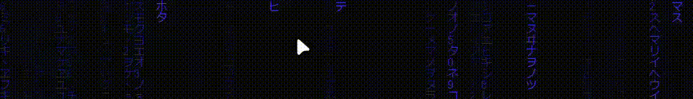

# Dynamic Cursor

This app makes your cursor more realistic by simulating how it would behave if it was an actual object being dragged across your screen. This means that your cursor can change based on how it is used, e.g. stretch in the direction you are moving or straight out rotate towards it.

This project is inspired by [VirtCode/hypr-dynamic-cursors](https://github.com/VirtCode/hypr-dynamic-cursors) but in windows using c++

---

## Simulation modes

The overlay includes two unique physics simulation modes toggled via the system tray. (The cursors shown below are the Bibata Cursor set).

| Stretch Animation Mode | Rotate Animation Mode |
| :---: | :---: |
|  |  |

---

## The Stack used

- **Language:** C++17 / C++20
- **Graphics Pipeline:** Direct2D, Windows Imaging Component (wincodec)
- **Windowing Context:** Win32 API Layered Windows (WS_EX_LAYERED, WS_EX_TRANSPARENT), Desktop Window Manager (dwmapi)
- **Build Configurations:** Linker dependencies include: `d2d1.lib`, `Windowscodecs.lib`, `ole32.lib`, `winmm.lib`, `dwmapi.lib`, `shell32.lib`, `comdlg32.lib`

---

## Configuration (`settings.ini`)

On initialization, the app creates a config folder containing a default `settings.ini` profile to modify physics attributes:

```ini
[Physics]
SimulationMode=0    ; 0 = Stretch (cursor squashes when moving fast), 1 = Rotate (cursor spins toward movement)
StiffnessFar=0.65   ; How fast cursor catches up when moving far away (0=slow/laggy, 1=instant)
StiffnessMedium=0.42; How fast cursor catches up during normal movement (0=slow, 1=instant)
StiffnessClose=0.24 ; How smooth cursor feels for small, precise movements (lower = smoother)
StretchFactor=0.025 ; How much the cursor stretches when moving (higher = more stretch)
MaxStretch=2.2      ; Maximum how far the cursor can stretch (prevents extreme distortion)
```

---

## Installation

### Download from Release

1. Head over to the [Releases](https://github.com/your-repo/releases) page
2. Download the latest version of DynamicCursor.exe
3. Place the .exe in your desired folder and run it

### Setup Custom Cursors

To use this app with custom cursors, you need to set up a cursor pack in Windows:

1. **Create a Cursor Pack:** Open Windows Control Panel and navigate to `Devices` → `Mouse` → `Pointers` tab
2. **Set All Cursors to Invisible:** Change all cursor schemes to use the `invisible-cursor.cur` [file](https://github.com/nobled/clutter/blob/master/clutter/win32/invisible-cursor.cur)
3. **Apply the Pack:** Apply the cursor pack to replace your system cursors

This allows the Dynamic Cursor overlay to display the animated cursors without interference from the default Windows cursor. The invisible cursor file is based on [nobled/clutter](https://github.com/nobled/clutter/blob/master/clutter/win32/invisible-cursor.cur)